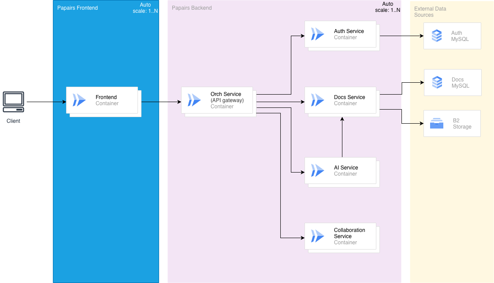

# Papairs

A collaborative document platform built with microservices architecture.

## Architecture



The system follows a gateway pattern where all client requests flow through the **Orchestration Service**, which handles routing, authentication validation and service coordination.

| Service | Technology | Purpose |
|---------|------------|---------|
| **Frontend** | Vue.js 3, Tailwind CSS | Client-side rendered SPA |
| **Orchestration** | Spring Cloud Gateway | API Gateway, routing, auth orchestration |
| **Auth Service** | Spring Boot, MySQL | User authentication and session management |
| **Docs Service** | Spring Boot, MySQL | Document CRUD and file storage (B2) |
| **AI Service** | Node.js, OpenAI | Autocomplete and document analysis |
| **Collaboration** | Hocuspocus (Y.js) | Real-time collaborative editing |

## Quick Start

```bash
# Start all services
docker compose up --build

# Or for development with hot-reload
docker compose up
```

**Access points:**
- Frontend: http://localhost:3000
- API Gateway: http://localhost:8080

## Project Structure

```
Papairs/
├── frontend/                    # Vue.js SPA
├── backend/
│   ├── orchestration-service/   # API Gateway (8080)
│   ├── auth-service/            # Authentication (8081)
│   ├── docs-service/            # Documents & Files (8082)
│   ├── ai-service/              # AI features (3001)
│   └── collaboration-service/   # Real-time sync (8083)
└── docker-compose.yml
```

## Development

Some services require `.env` files — see [`docs/example.env`](./docs/example.env) for the full template.

### Running individual services

```bash
# Java services (auth, docs, orchestration)
cd backend/<service-name>
mvn spring-boot:run

# Node services (ai, collaboration)
cd backend/<service-name>
npm install && npm start

# Frontend
cd frontend
npm install && npm run serve
```

## Prerequisites

- Docker & Docker Compose (recommended)
- Or: Node.js 18+, Java 17+, Maven